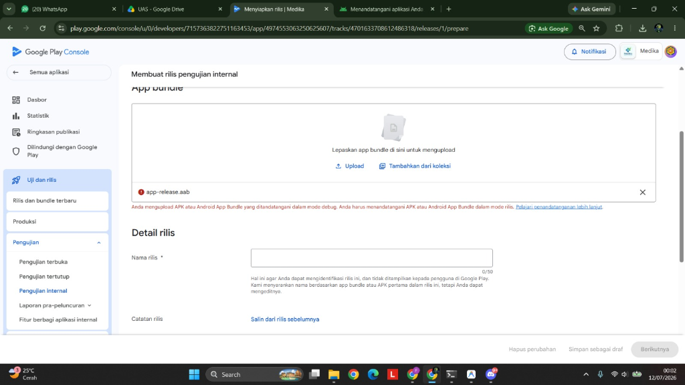
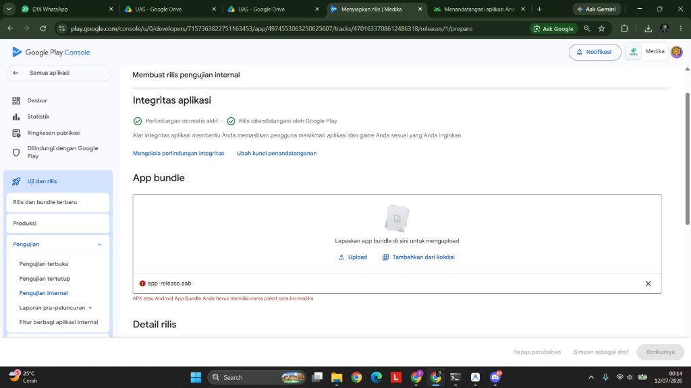
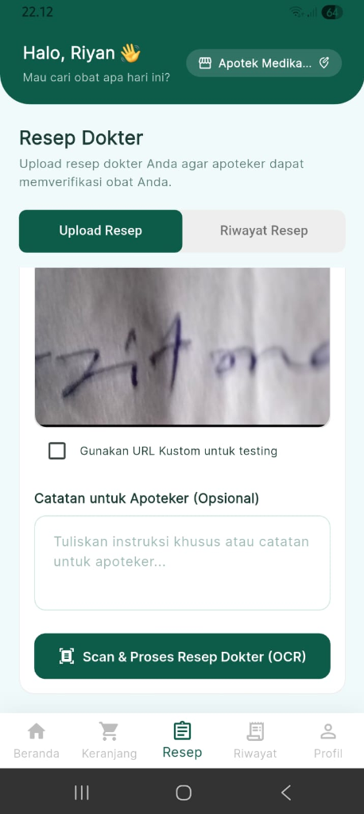

# 📄 Dokumen Laporan Insiden & Dokumentasi Bug
Aplikasi **Apotek POS (Medika)** — Versi Mobile & Web

Dokumen ini disusun untuk mencatat insiden rilis Google Play Store, mendokumentasikan bug yang ditemukan dan diselesaikan dari analisis kode, serta menyediakan template standar untuk tim di masa mendatang.

---

## 📂 Daftar Isi
1. [Laporan Insiden Riwayat Rilis (Incident Report - Play Store Release)](#1-laporan-insiden-riwayat-rilis-incident-report---play-store-release)
2. [Template Laporan Insiden Standar (Incident Report Template)](#2-template-laporan-insiden-standar-incident-report-template)
3. [Template Dokumentasi Bug Standar (Bug Documentation Template)](#3-template-dokumentasi-bug-standar-bug-documentation-template)
4. [Dokumentasi Bug yang Ditemukan & Diselesaikan](#4-dokumentasi-bug-yang-ditemukan--diselesaikan)
   * [Bug 1: Penolakan Kunci Tanda Tangan Debug di Play Store](#bug-1-penolakan-kunci-tanda-tangan-debug-di-play-store)
   * [Bug 2: Ketidakcocokan Nama Paket (Application ID) di Play Store](#bug-2-ketidakcocokan-nama-paket-application-id-di-play-store)
   * [Bug 3: Fitur Scan OCR Resep Gagal Membaca Tulisan Tangan (Silent Failure)](#bug-3-fitur-scan-ocr-resep-gagal-membaca-tulisan-tangan-silent-failure)
   * [Bug 4: Kegagalan Kompilasi Kotlin di Windows (Drive Root Mismatch)](#bug-4-kegagalan-kompilasi-kotlin-di-windows-drive-root-mismatch)
   * [Bug 5: Hang Tanpa Batas Saat Login di HP Samsung (Keystore Cloud Restore)](#bug-5-hang-tanpa-batas-saat-login-di-hp-samsung-keystore-cloud-restore)
   * [Bug 6: PlatformException (Channel Error) Kamera di Versi Mobile Rilis](#bug-6-platformexception-channel-error-kamera-di-versi-mobile-rilis)

---

## 1. Laporan Insiden Riwayat Rilis (Incident Report - Play Store Release)

Berikut adalah laporan insiden nyata yang terjadi saat proses rilis aplikasi Medika ke Google Play Store berdasarkan riwayat aktivitas pengembangan kita.

# 🚨 LAPORAN INSIDEN: Kegagalan Pengunggahan AAB ke Google Play Console

## Ringkasan Eksekutif
*   **ID Insiden:** INC-20260712-01
*   **Tanggal Kejadian:** 12 Juli 2026
*   **Waktu Mulai:** 00:02 WIB
*   **Waktu Selesai:** 00:23 WIB
*   **Durasi:** 21 Menit
*   **Dampak Bisnis:** Proses publikasi aplikasi Medika versi Android ke Google Play Store terhambat karena berkas instalasi (`.aab`) ditolak berulang kali oleh sistem keamanan Google Play.
*   **Skala Keparahan (Severity):** 🔴 **Critical** (Memblokir rilis aplikasi baru ke publik)
*   **Pemilik Masalah (Owner):** Tim Pengembang Apotek POS

## Kronologi Kejadian (Timeline)
*   **12 Juli 2026, 00:02 WIB** - Pengguna melaporkan bahwa file `app-release.aab` yang diunggah ke Google Play Console ditolak dengan error tanda tangan debug (*debug keystore*).
*   **12 Juli 2026, 00:06 WIB** - Pengembang berhasil membuat kunci tanda tangan rilis (`upload-keystore.jks`), mengonfigurasi `key.properties`, memperbarui `build.gradle.kts`, dan menyelesaikan kompilasi ulang AAB bertandatangan rilis.
*   **12 Juli 2026, 00:14 WIB** - Pengguna mengunggah berkas AAB baru, namun kembali ditolak oleh Play Console karena ketidakcocokan nama paket (*Application ID Mismatch*: `com.example.apotek_web` vs `com.hn.medika`).
*   **12 Juli 2026, 00:16 WIB** - Pengembang mulai memodifikasi berkas konfigurasi build Android untuk mengganti nama paket di Gradle, memindahkan direktori kelas Kotlin `MainActivity.kt` ke paket `com.hn.medika`, dan melakukan build ulang bersih.
*   **12 Juli 2026, 00:23 WIB** - Proses build AAB dengan konfigurasi nama paket yang benar selesai. Berkas berhasil diunggah ke Google Play Console tanpa error lagi (Sistem Rilis Pulih).

## Penyebab Utama (Root Cause Analysis - RCA)
1.  **Debug Key Signing:** Gradle Android secara default mengompilasi rilis menggunakan sertifikat debug bawaan (`debug.keystore`) jika blok konfigurasi `signingConfigs` rilis tidak didefinisikan secara eksplisit.
2.  **Application ID Mismatch:** Proyek menggunakan nama paket default dari inisialisasi Flutter (`com.example.apotek_web`), sedangkan akun Google Play Console telah didaftarkan dengan nama paket unik khusus (**`com.hn.medika`**).

## Tindakan Perbaikan (Corrective & Preventive Actions)
1.  **Tindakan Langsung (Short-term Fix):**
    *   Membuat berkas `upload-keystore.jks` secara offline dan mengunci kredensial penandatanganan di file `key.properties`.
    *   Mengubah konfigurasi `namespace` dan `applicationId` menjadi `com.hn.medika` serta merefaktor penempatan folder `MainActivity.kt`.
2.  **Tindakan Pencegahan (Long-term Prevention):**
    *   Menambahkan pemeriksaan nama paket sebelum rilis pertama dilakukan.
    *   Menyimpan dokumentasi kredensial penandatanganan secara aman dan tidak memasukkannya ke sistem Git publik (menambahkan file `.jks` dan `.properties` ke `.gitignore`).

---

## 2. Template Laporan Insiden Standar (Incident Report Template)

Gunakan template kosong ini untuk mencatat insiden baru di masa mendatang.

```markdown
# 🚨 LAPORAN INSIDEN: [Nama Insiden Singkat]

## Ringkasan Eksekutif
*   **ID Insiden:** INC-[TANGGAL]-[NOMOR_URUT]
*   **Tanggal Kejadian:** [DD/MM/YYYY]
*   **Waktu Mulai:** [HH:MM WIB]
*   **Waktu Selesai:** [HH:MM WIB] (atau "Dalam Penanganan")
*   **Durasi:** [Jam/Menit]
*   **Dampak Bisnis:** [Sebutkan fitur apa yang mati atau layanan apa yang terganggu bagi pengguna]
*   **Skala Keparahan (Severity):** [Critical / High / Medium / Low]
*   **Pemilik Masalah (Owner):** [Nama Pengembang / Tim]

## Kronologi Kejadian (Timeline)
*   **[HH:MM WIB]** - [Deteksi awal / Munculnya error / Laporan pengguna]
*   **[HH:MM WIB]** - [Analisis awal oleh tim developer]
*   **[HH:MM WIB]** - [Penyebab utama (Root Cause) ditemukan]
*   **[HH:MM WIB]** - [Solusi/Pembaruan kode diterapkan ke staging/produksi]
*   **[HH:MM WIB]** - [Verifikasi selesai, sistem dinyatakan pulih]

## Penyebab Utama (Root Cause Analysis - RCA)
[Jelaskan secara mendalam mengapa kesalahan ini terjadi secara teknis dan apa pemicunya.]

## Tindakan Perbaikan (Corrective & Preventive Actions)
1.  **Tindakan Langsung (Short-term Fix):** [Apa yang dilakukan saat itu juga agar sistem berjalan lagi.]
2.  **Tindakan Pencegahan (Long-term Prevention):** [Apa yang diubah dalam jangka panjang agar error serupa tidak terulang kembali.]
```

---

## 3. Template Dokumentasi Bug Standar (Bug Documentation Template)

Gunakan template ini untuk mendokumentasikan temuan bug baru.

```markdown
# 🐛 DOKUMENTASI BUG: [Judul Singkat Mengenai Error]

## Detail Bug
*   **ID Bug:** BUG-[NOMOR]
*   **Komponen Terkait:** [Contoh: Mobile UI / Backend API / Database]
*   **Skala Keparahan (Severity):** [Tentukan tingkat keparahan]
    *   🔴 *Critical* (Aplikasi crash, data hilang, atau proses bisnis utama terhenti total)
    *   🟠 *High* (Fitur utama gagal berfungsi, tapi aplikasi tidak crash dan ada workaround)
    *   🟡 *Medium* (Fitur minor gagal berfungsi, atau masalah kosmetik/tata letak yang mengganggu)
    *   🟢 *Low* (Masalah kecil, salah ketik, atau visual kosmetik tanpa dampak fungsional)
*   **Ditemukan Oleh:** [Nama Penguji / Pengguna]
*   **Ditemukan Pada Versi:** [Contoh: v1.0.0-APK]

## Langkah untuk Mereproduksi (Steps to Reproduce)
1.  [Langkah 1, contoh: Buka halaman Login]
2.  [Langkah 2, contoh: Ketik email dan password salah]
3.  [Langkah 3, contoh: Tekan tombol Masuk]

## Ekspektasi vs Realita (Expected vs Actual Behavior)
*   **Ekspektasi (Expected):** [Apa yang seharusnya terjadi secara logika bisnis/fungsional]
*   **Realita (Actual):** [Apa yang kenyataannya terjadi di sistem / layar aplikasi]

## Solusi / Tambalan Kode (Resolution / Fix)
*   **Penyebab Teknis:** [Mengapa kode program tersebut gagal secara logika]
*   **Perubahan Kode:**
    ```diff
    - [Kode lama yang salah]
    + [Kode baru yang benar]
    ```
*   **Status:** [Teratasi / Masih Terbuka / Dalam Peninjauan]
```

---

## 4. Dokumentasi Bug yang Ditemukan & Diselesaikan

Berikut adalah rincian teknis dari bug-bug yang berhasil diselesaikan berdasarkan riwayat chat pengembangan kita.

### Bug 1: Penolakan Kunci Tanda Tangan Debug di Play Store
*   **ID Bug:** BUG-001
*   **Komponen Terkait:** Android Deployment Configuration
*   **Skala Keparahan:** 🔴 **Critical**
*   **Ditemukan Oleh:** Riyan (Pengguna)
*   **Ditemukan Pada Versi:** v1.0.0-AAB (Kompilasi Lokal Pertama)
*   **Tanggal Temuan:** 12 Juli 2026, 00:02 WIB
*   **Langkah untuk Mereproduksi:**
    1. Jalankan perintah `flutter build appbundle --release`.
    2. Buka Google Play Console > Versi Pengujian Internal.
    3. Unggah file `app-release.aab` yang dihasilkan.
*   **Ekspektasi (Expected):** Google Play Console menerima file bundle aplikasi untuk didistribusikan.
*   **Realita (Actual):** Layar Play Console memunculkan pesan kesalahan: *"Anda mengupload APK atau Android App Bundle yang ditandatangani dalam mode debug..."*
*   **Foto Bukti Masalah:**
    
*   **Solusi (Resolution):**
    *   Membuat berkas `upload-keystore.jks` menggunakan JDK `keytool`.
    *   Membuat file `key.properties` di folder `/android/`.
    *   Memodifikasi [build.gradle.kts](file:///D:/!semester6/!a/apotek-pos/apotek_web/android/app/build.gradle.kts) untuk memuat kunci rilis secara dinamis.

---

### Bug 2: Ketidakcocokan Nama Paket (Application ID) di Play Store
*   **ID Bug:** BUG-002
*   **Komponen Terkait:** Android Configuration / Manifest
*   **Skala Keparahan:** 🔴 **Critical**
*   **Ditemukan Oleh:** Riyan (Pengguna)
*   **Ditemukan Pada Versi:** v1.0.0-AAB (Kompilasi Lokal Kedua)
*   **Tanggal Temuan:** 12 Juli 2026, 00:14 WIB
*   **Langkah untuk Mereproduksi:**
    1. Bangun bundle rilis bertandatangan resmi.
    2. Coba unggah file `.aab` tersebut ke rilis pengujian internal.
*   **Ekspektasi (Expected):** Nama paket di berkas AAB cocok dengan entri registrasi Play Console (`com.hn.medika`).
*   **Realita (Actual):** Pengunggahan gagal dengan pesan kesalahan: *"APK atau Android App Bundle Anda harus memiliki nama paket com.hn.medika"*.
*   **Foto Bukti Masalah:**
    
*   **Solusi (Resolution):**
    *   Mengubah `namespace` dan `applicationId` pada [build.gradle.kts](file:///D:/!semester6/!a/apotek-pos/apotek_web/android/app/build.gradle.kts) menjadi `com.hn.medika`.
    *   Memindahkan berkas [MainActivity.kt](file:///D:/!semester6/!a/apotek-pos/apotek_web/android/app/src/main/kotlin/com/hn/medika/MainActivity.kt) ke path folder baru `com/hn/medika` dan memperbarui baris deklarasi package.

---

### Bug 3: Fitur Scan OCR Resep Gagal Membaca Tulisan Tangan (Silent Failure)
*   **ID Bug:** BUG-003
*   **Komponen Terkait:** Mobile Pasien Prescription Screen / OCR Module
*   **Skala Keparahan:** 🟠 **High**
*   **Ditemukan Oleh:** Riyan (Pengguna)
*   **Ditemukan Pada Versi:** v1.0.0-APK (Rilis Uji Coba Pertama)
*   **Tanggal Temuan:** 11 Juli 2026, 22:13 WIB
*   **Langkah untuk Mereproduksi:**
    1. Buka aplikasi di HP, navigasi ke tab **Resep**.
    2. Ambil/pilih foto resep dokter dengan tulisan tangan sambung (contoh tulisan *"Azitoma"*).
    3. Tekan tombol **Scan & Proses Resep Dokter (OCR)**.
*   **Ekspektasi (Expected):** Aplikasi menampilkan hasil pembacaan obat atau memunculkan pesan bahwa tulisan tangan tidak terbaca agar pengguna dapat mengambil foto ulang.
*   **Realita (Actual):** Lingkaran loading berputar sejenak lalu menghilang tanpa ada pesan SnackBar atau perubahan UI apa pun (Silent Failure).
*   **Foto Bukti Masalah:**
    
*   **Solusi (Resolution):**
    *   Mengalihkan alur pemrosesan dari offline Google ML Kit lokal (yang hanya mendukung teks cetak) ke server backend `/external/ocr-prescription` yang memiliki model ONNX kustom latihan Anda (`ocr_prescription_model.onnx`).
    *   Menambahkan SnackBar peringatan jika hasil pembacaan resep tetap kosong agar pengguna mendapat umpan balik visual yang jelas.

---

### Bug 4: Kegagalan Kompilasi Kotlin di Windows (Drive Root Mismatch)
*   **ID Bug:** BUG-004
*   **Komponen Terkait:** Local Build Environment / NDK compiler
*   **Skala Keparahan:** 🟠 **High**
*   **Ditemukan Oleh:** Developer (AI Assistant)
*   **Ditemukan Pada Versi:** Kompilasi AAB Lokal Pertama
*   **Tanggal Temuan:** 11 Juli 2026, 22:53 WIB
*   **Langkah untuk Mereproduksi:**
    1. Letakkan proyek di Drive D (`D:\!semester6\!a\apotek-pos\apotek_web`).
    2. Jalankan perintah `flutter build appbundle` di Windows dengan pub cache berada di Drive C.
*   **Ekspektasi (Expected):** Kompilasi berjalan lancar dan menghasilkan file AAB.
*   **Realita (Actual):** Build gagal dengan error: `IllegalArgumentException: this and base files have different roots` saat memproses kode Kotlin plugin `image_picker_android`.
*   **Solusi (Resolution):**
    *   Karena fungsionalitas OCR lokal di HP sudah dialihkan ke backend, dependensi `google_mlkit_text_recognition` dihapus dari [pubspec.yaml](file:///D:/!semester6/!a/apotek-pos/apotek_web/pubspec.yaml).
    *   Ini menghilangkan dependensi plugin C++ (`jni`) yang bermasalah. Untuk kompilasi awal, proyek disalin ke Drive C sementara untuk menyelesaikan kompilasi tanpa batasan lintas disk.

---

### Bug 5: Hang Tanpa Batas Saat Login di HP Samsung (Keystore Cloud Restore)
*   **ID Bug:** BUG-005
*   **Komponen Terkait:** Auth Provider / Secure Storage
*   **Skala Keparahan:** 🔴 **Critical**
*   **Ditemukan Oleh:** Teman Pengguna (Samsung User)
*   **Ditemukan Pada Versi:** v1.0.0-APK (Rilis Uji Coba Pertama)
*   **Tanggal Temuan:** 4 Juli 2026, 10:00 WIB
*   **Langkah untuk Mereproduksi:**
    1. Instal aplikasi di HP Samsung Knox yang memiliki backup awan aktif.
    2. Lakukan login dan biarkan sistem mencadangkan data.
    3. Hapus dan pasang kembali aplikasi (reinstall), lalu coba buka aplikasi dan login kembali.
*   **Ekspektasi (Expected):** Aplikasi langsung masuk ke halaman utama atau meminta login bersih.
*   **Realita (Actual):** Aplikasi macet pada layar loading putih/lingkaran berputar selamanya di halaman masuk karena Keystore kunci dekripsi yang pulih dari cloud tidak valid.
*   **Solusi (Resolution):**
    *   Mengaktifkan `encryptedSharedPreferences: true` untuk platform Android.
    *   Membungkus seluruh pemanggilan data secure storage di file `api_client.dart` dan `auth_provider.dart` dengan blok `try-catch` yang dilengkapi batas waktu tunggu (`timeout`) selama 1–2 detik.
    *   Menjalankan fungsi `deleteAll()` (self-healing) secara otomatis saat terjadi kegagalan dekripsi atau timeout untuk meriset penyimpanan aman secara bersih.

---

### Bug 6: PlatformException (Channel Error) Kamera di Versi Mobile Rilis
*   **ID Bug:** BUG-006
*   **Komponen Terkait:** Mobile Native Plugins / Platform Channel
*   **Skala Keparahan:** 🟠 **High**
*   **Ditemukan Oleh:** Riyan (HP Pasien)
*   **Ditemukan Pada Versi:** v1.0.0-APK (Rilis Uji Coba Pertama)
*   **Tanggal Temuan:** 4 Juli 2026, 10:15 WIB
*   **Langkah untuk Mereproduksi:**
    1. Jalankan aplikasi versi rilis APK di HP.
    2. Navigasi ke menu Unggah Resep Dokter.
    3. Tekan tombol Ambil Kamera atau Galeri.
*   **Ekspektasi (Expected):** Kamera HP terbuka untuk mengambil foto resep.
*   **Realita (Actual):** Aplikasi memunculkan error crash bertuliskan `PlatformException(channel-error)`.
*   **Solusi (Resolution):**
    *   Memindahkan paket-paket native (`image_picker`, `permission_handler`) dari `dev_dependencies` ke bagian **`dependencies`** utama pada [pubspec.yaml](file:///D:/!semester6/!a/apotek-pos/apotek_web/pubspec.yaml) agar native bindings-nya terdaftar di release build.
